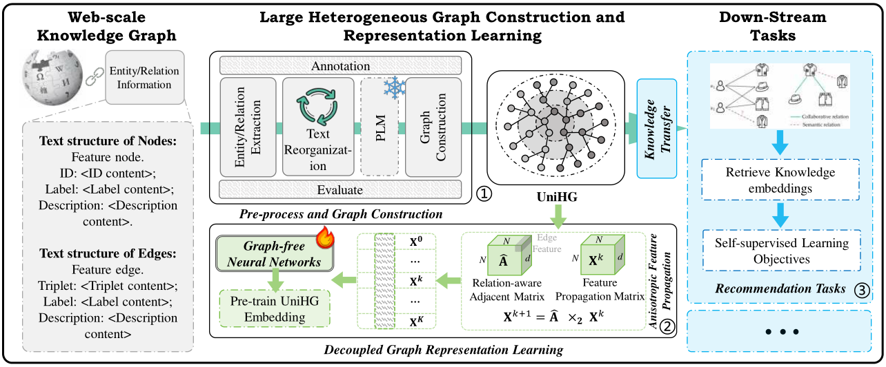
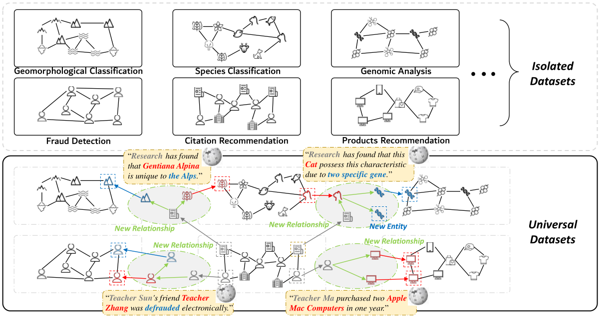
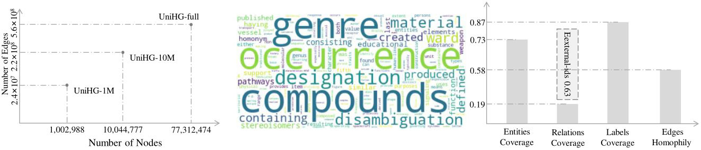
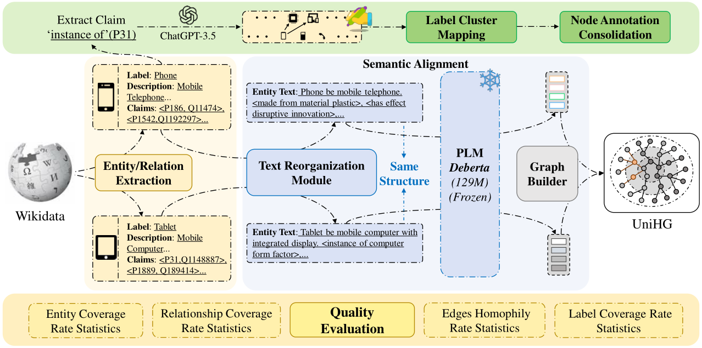
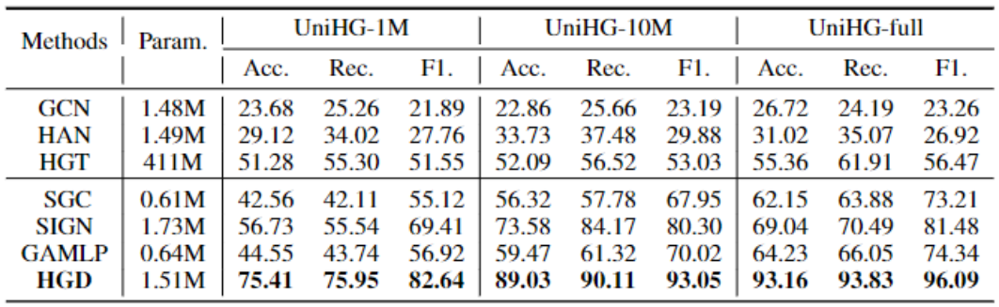
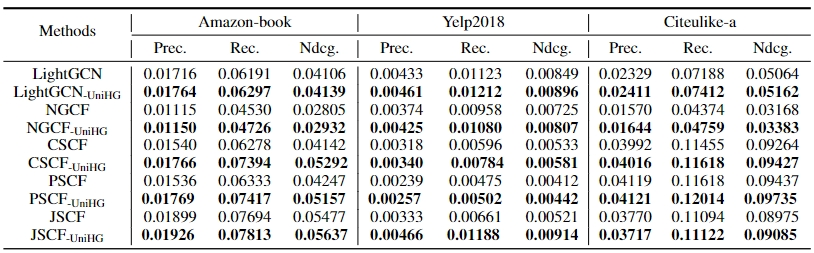
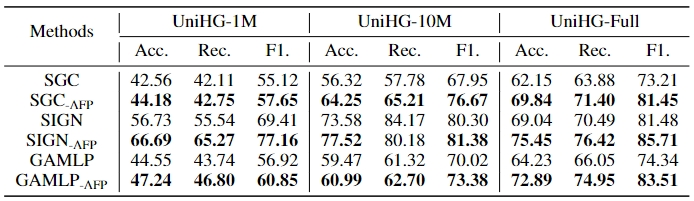
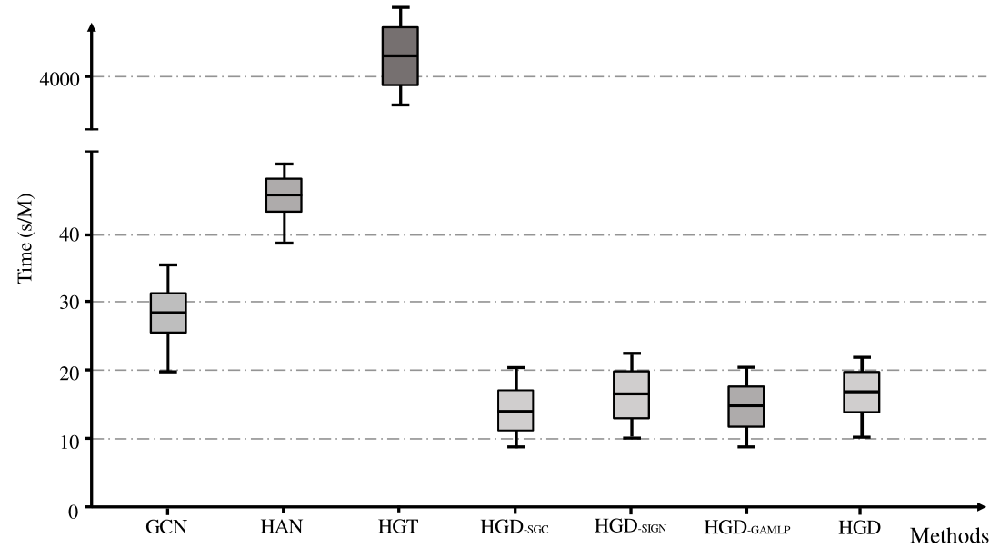

# UniHG

This is the official implementation of the paper **UniHG: A Benchmark and Universal Embedding for Large-Scale Heterogeneous Graphs**.

## Requirements:
```
torch                         2.0.1+cu117
numpy                         1.21.5
optuna                        3.5.0
scikit-learn                  1.0.2
scipy                         1.7.3
dgl                           1.1.1+cu113
torch-cluster                 1.6.1
torch-geometric               2.3.1
torch-scatter                 2.1.1
torch-sparse                  0.6.17
torch-spline-conv             1.2.2
networkx                      3.1
ogb                           1.3.6
nltk                          3.8.1
cupy                          12.2.0

```
## Pipeline
This work focuses on constructing the largest universal domain heterogeneous graph available and effectively learning its representation as well as transferring the universal knowledge to other downstream graph task. The overall task pipeline is shown below:


## Preprocessing:

We use the **JSON** version of all wikidata data from June 23, 2023 to form our dataset.
See preprocessing for more details on our processing strategy.

## Datasets:
UniHG is a universal dataset compared to other isolated datasets. This means that there are "bridges" in UniHG that connect these isolated datasets. Naturally, UniHG also has more types of nodes and edges. The visualization of the generic dataset is illustrated in the figure below:

We further evaluated UniHG using multiple metrics, as visualized in the following figure:


### UniHG-1M:
This is the smallest version (489.7MB × 5) of **UniHG**. It has 1,002,988 nodes and 24,475,405 edges. We have provided its 5-hop feature propagation matrixes to facilitate learning using decoupled graph neural networks. You can find **UniHG-1M** at [link](https://pan.quark.cn/s/fcf6c2ae7554).

### UniHG-10M:
This is a medium-sized version (4.79GB × 5) of **UniHG**. It has 10,044,777 nodes and 216,295,022 edges. You can find **UniHG-10M** at [link](https://pan.quark.cn/s/128a3c656005).

### UniHG-Full:
This is the largest version (36.87GB × 5) of **UniHG**. It has 77,312,474 nodes and 641,738,096 edges. You can find **UniHG-Full** at [link](https://pan.quark.cn/s/252cf3117451).

## How to construct UniHG?
We have mapped the overall flow of the composition, see Fig:


## Training:
Further, in order to efficiently learn complex representations of UniHG, we propose a new representation learning framework **HGD** (Heterogeneous Graph Decoupling Framework). To evaluate the effectiveness of **HGD**, we compare other sampling-based convolutional type graph neural networks (**GCN**, **HAN**, **HGT**) and decoupling-based graph neural networks (**SGC**, **SIGN**, **GAMLP**) on three sizes of UniHG datasets. We used official implementations of these methods.
The training commands are detailed in the individual run.sh files in the models.

## Results:

Results of comparison experiments on **UniHG-1M**, **UniHG-10M**, and **UniHG-full**:



Results of knowledge transfer experiments on recommendation system:



Results of the ablation experiments on **UniHG-1M**, **UniHG-10M**, and **UniHG-full**. '-AFP' means 'using the feature of Anisotropic Feature Propagation'.



Training time statistics of baselines for multi-label node classification. We report the time for training each **1M nodes.* (Low is faster)



# Reference
```
@article{qiu2023unihg,
  title={UniHG: A Benchmark and Universal Embedding for Large-Scale Heterogeneous Graphs},
  author={Qiu, Yide and Ling, Shaoxiang and Zhang, Tong and Huang, Bo and Cui, Zhen},
  journal={arXiv preprint arXiv:2309.05269},
  year={2023}
}
```
# License
```
MIT
```

