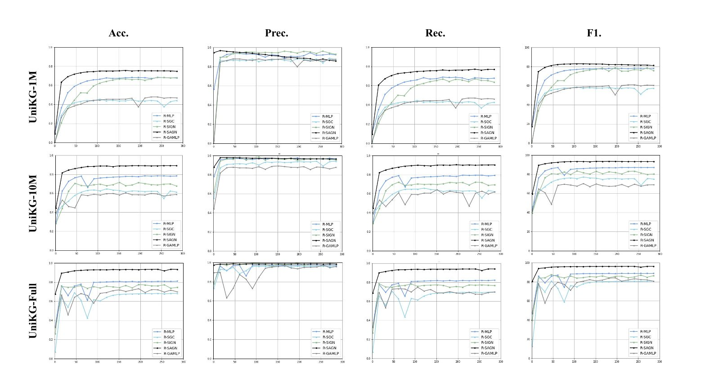

# UniKG

This is the official implementation of the paper **UniKG: A Benchmark and Universal Embedding for Large-Scale Knowledge Graphs**.

## Requirements

The PyTorch version we use is torch 2.0.1+cu117.

## Preprocessing

We use the **JSON** version of all wikidata data from June 23, 2023 to form our dataset.
See preprocessing for more details on our processing strategy.

## Training

We use the official implementations of **OGB** from **SAGN**, **SIGN**, **GAMLP**, **SGC**, **MLP**.
The training commands are detailed in the individual run.sh files in the models.

## Results：

Performance of 5 methods on 3 scales of **UniKG**:

