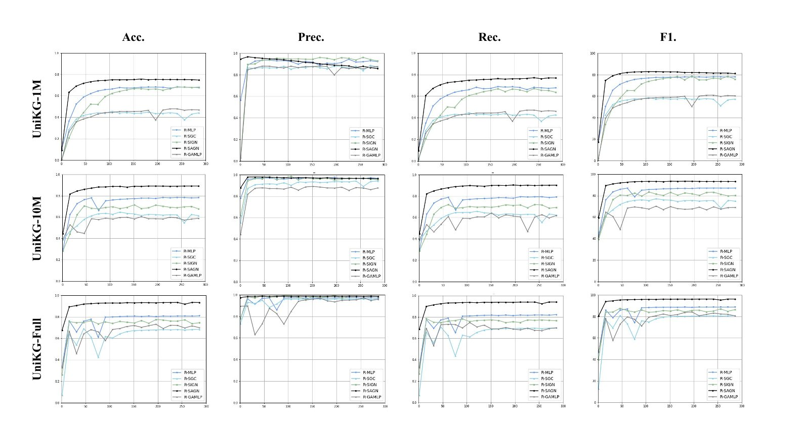
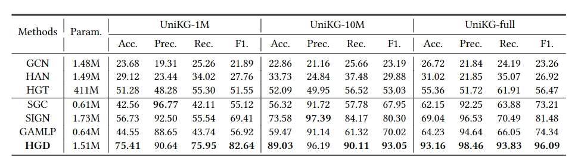
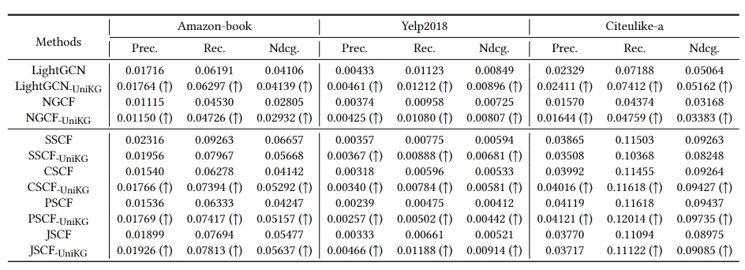
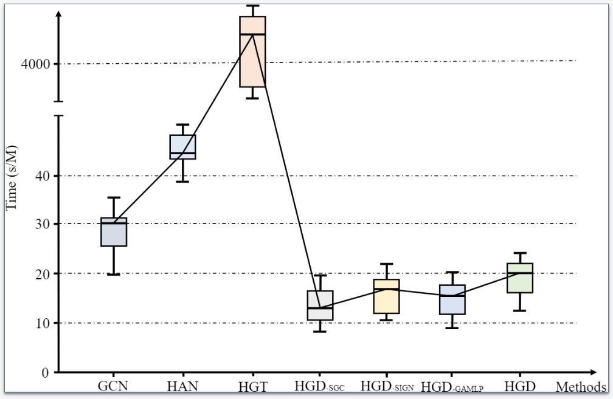

# UniKG

This is the official implementation of the paper **UniKG: A Benchmark and Universal Embedding for Large-Scale Knowledge Graphs**.

## Requirements:
```
torch                         2.0.1+cu117
numpy                         1.21.5
optuna                        3.5.0
scikit-learn                  1.0.2
scipy                         1.7.3
dgl                           1.1.1+cu113
torch-cluster                 1.6.1
torch-geometric               2.3.1
torch-scatter                 2.1.1
torch-sparse                  0.6.17
torch-spline-conv             1.2.2
networkx                      3.1
ogb                           1.3.6
```

## Preprocessing:

We use the **JSON** version of all wikidata data from June 23, 2023 to form our dataset.
See preprocessing for more details on our processing strategy.

## Datasets:

### UniKG-1M:
This is the smallest version (489.7MB × 5) of **UniKG**. It has 1,002,988 nodes and 24,475,405 edges. We have provided its 5-hop feature propagation matrixes to facilitate learning using decoupled graph neural networks. You can find **UniKG-1M** at [link](https://pan.quark.cn/s/fcf6c2ae7554).

### UniKG-10M:
This is a medium-sized version (4.79GB × 5) of **UniKG**. It has 10,044,777 nodes and 216,295,022 edges. Related resources are being released.

### UniKG-Full:
This is the largest version (36.87GB × 5) of **UniKG**. It has 77,312,474 nodes and 641,738,096 edges. Related resources are being released.

## Training:

We use the official implementations of **SAGN**, **SIGN**, **GAMLP**, **SGC**, **MLP** from **OGB**.
The training commands are detailed in the individual run.sh files in the models.

## Results:

Performances of 5 methods on 3 scales of **UniKG**:



Results of comparison experiments on **UniKG-1M**, **UniKG-10M**, and **UniKG-full**:



Results of knowledge transfer experiments on recommendation system:



Results of the ablation experiments on **UniKG-1M**, **UniKG-10M**, and **UniKG-full**.:


Training time statistics of baselines for multi-label node classification. We report the time for training each **1M nodes.* (Low is faster)



# Reference
```
@article{qiu2023unikg,
  title={UniKG: A Benchmark and Universal Embedding for Large-Scale Knowledge Graphs},
  author={Qiu, Yide and Ling, Shaoxiang and Zhang, Tong and Huang, Bo and Cui, Zhen},
  journal={arXiv preprint arXiv:2309.05269},
  year={2023}
}
```
# License
```
MIT
```

